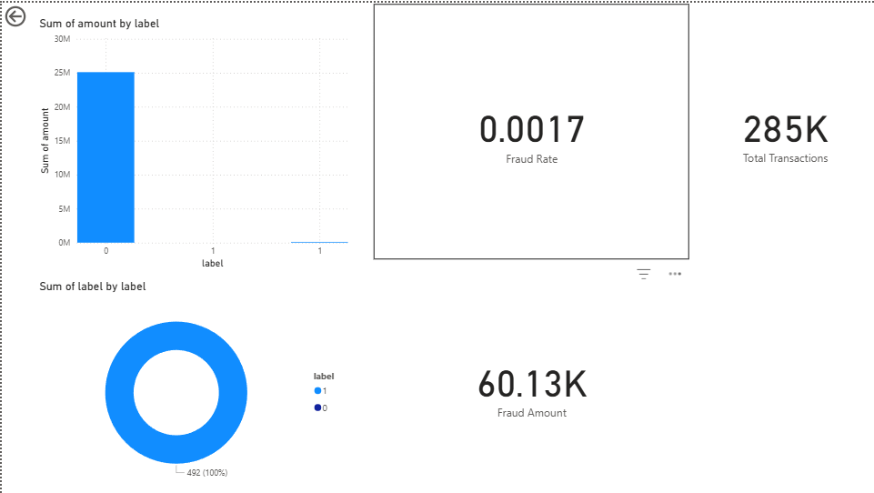

# PowerBiMLaaS

Here's a draft `README.md` tailored to your description and based on the extracted project structure:

---

# Fraud Detection ML App (Prototype)

## 🧠 Project Concept

This repository is designed to support **rapid prototyping of ML pipelines** with a focus on fraud detection, particularly credit card fraud. It integrates powerful AI tools and a modular architecture to allow:

* Schema translation from arbitrary CSVs or database tables
* AI-assisted transformation into model-compatible schemas
* Real-time fraud prediction
* Integration with a PostgreSQL database
* Natural language dashboard generation via Power BI and Claude API

This is **prototype code**. The product is **not finished**, but the foundations for a full-stack AI-powered fraud analytics engine are in place.

---

## 🧩 Core Features

### 🔁 Schema Adapter

An AI-powered adapter ingests incoming datasets with unknown schema and maps them into the expected model input format.

### 🤖 ML Model

Trained on open-source credit card fraud datasets using traditional ML and HuggingFace models. Designed to support future plug-and-play extensions.

### 🧠 NLP-Powered Queries

Utilizes [Claude by Anthropic](https://www.anthropic.com/index/claude) and LangChain to:

* Answer user questions
* Auto-generate dashboards from natural language
* Assist with data exploration

### 📊 Dashboard Generation (Power BI)

Prototype includes Power BI dashboard integration as shown below:



### 🐳 Dockerized Deployment

Includes `docker-compose` configurations and environment setups to enable containerized full-stack deployment.

---

## 🏗️ Tech Stack

| Layer         | Technology                                          |
| ------------- | --------------------------------------------------- |
| Backend       | FastAPI, Claude (Anthropic), LangChain, HuggingFace |
| ML & AI       | Scikit-learn, Transformers, Pandas                  |
| Data Layer    | PostgreSQL, pgvector                                |
| UI            | React, React Flow, TypeScript (in progress)         |
| Visualization | Power BI                                            |
| Infra         | Docker, docker-compose                              |

---

## 🚧 Status

This is **prototype** code.

* 🔨 Core fraud detection pipeline: **Functional**
* 📡 API and model inference: **Connected**
* 🗃️ Postgres DB: **Running**
* 🧠 NLP interface (Claude): **Integrated**
* 🖼️ UI (React/PowerBI): **In progress**

---

## 📁 Directory Overview

```bash
fradetection_ml_app/
├── backend_mlaas/
│   ├── ai_schema_models/     # Claude + Mistral schema adapters
│   ├── docker-compose.yml
│   ├── backend_test.py
│   └── requirements.txt
├── PowerbiDashboardSample.png
├── start_ai_analytics.bat
└── AI_ANALYTICS_README.md
```

---

## ✅ Setup Instructions

1. **Environment**

   ```bash
   python -m venv venv
   source venv/bin/activate
   pip install -r backend_mlaas/requirements.txt
   ```

2. **Claude API Key**
   Set your Claude key in `.env.local`:

   ```
   CLAUDE_API_KEY=your_key_here
   ```

3. **Docker (Postgres + App)**

   ```bash
   docker-compose up --build
   ```

4. **App Start**

   ```bash
   python backend_test.py
   ```

---

## 📌 Final Notes

This project is part of a larger vision to enable **drag-and-drop fraud analytics** powered by LLMs. The next stages include completing the React Flow interface and integrating CSV drag-drop ingestion.

---

Let me know if you'd like a PDF or `.md` export of this README or want to rename/refactor folders to match production conventions.

